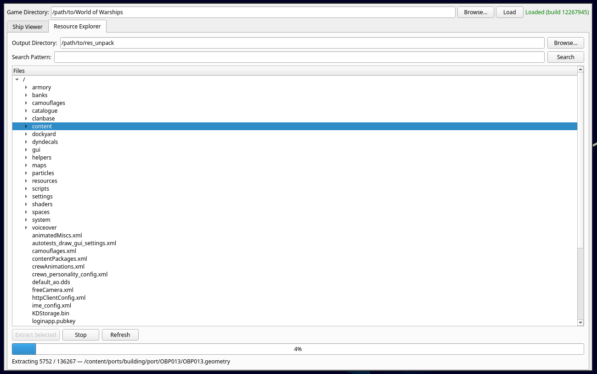
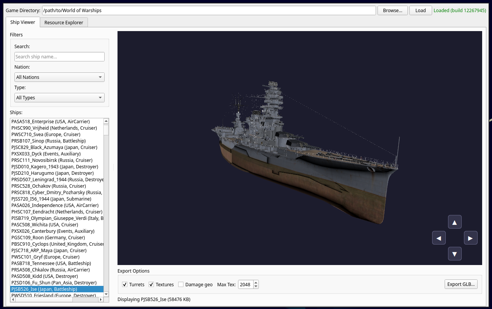

# wows-extractor-gui

QT GUI for extracting/exporting World of Warships resource files and 3d models.

The application bundles the [wows-depack](https://github.com/wows-tools/wows-depack) and [wows-geometry](https://github.com/wows-tools/wows-geometry) (`wows-model-exporter` submodule) libraries for browsing game indices, extracting files, and previewing or exporting ship geometry.

## Screenshots





## Requirements

- CMake 3.16 or newer
- C++17 compiler
- Qt 6 (Core, Widgets, Quick, QuickWidgets, Quick3D)
- Zlib, PCRE2 (`libpcre2-8`), meshoptimizer, Python 3 development headers, TinyGLTF

## Clone

This repository uses Git submodules:

```bash
git clone --recurse-submodules https://github.com/wows-tools/wows-extractor-gui
cd wows-extractor-gui
```

If you already cloned without submodules:

```bash
git submodule update --init --recursive
```

## Build (Linux, Debian/Ubuntu-style packages)

Install dependencies (names may differ slightly on other distributions):

```bash
sudo apt install \
  build-essential cmake ninja-build \
  qt6-base-dev qt6-declarative-dev qt6-quick3d-dev \
  zlib1g-dev libpcre2-dev libpython3-dev \
  libtinygltf-dev libmeshoptimizer-dev
```

Configure and build:

```bash
cmake -B build -G Ninja -DCMAKE_BUILD_TYPE=Release
cmake --build build
```

The executable is written to `build/bin/wows-extractor`.

Install system-wide (optional):

```bash
cmake --install build
```

## Run

```bash
./build/bin/wows-extractor
```

## License

[GNU General Public License v3.0](LICENSE)

## Notes

- **Game data**: you need a local World of Warships installation or copied game/res directory; the UI asks for the game/index path.
- **Qt Quick 3D** uses OpenGL; ensure your graphics drivers support OpenGL 3.3 Core (or the profile your Qt build targets).
